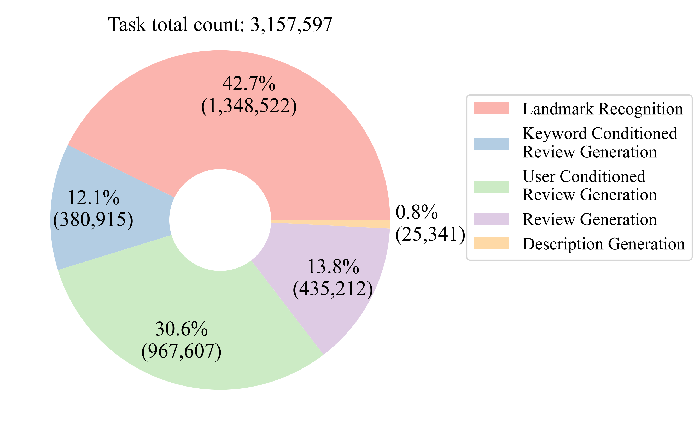
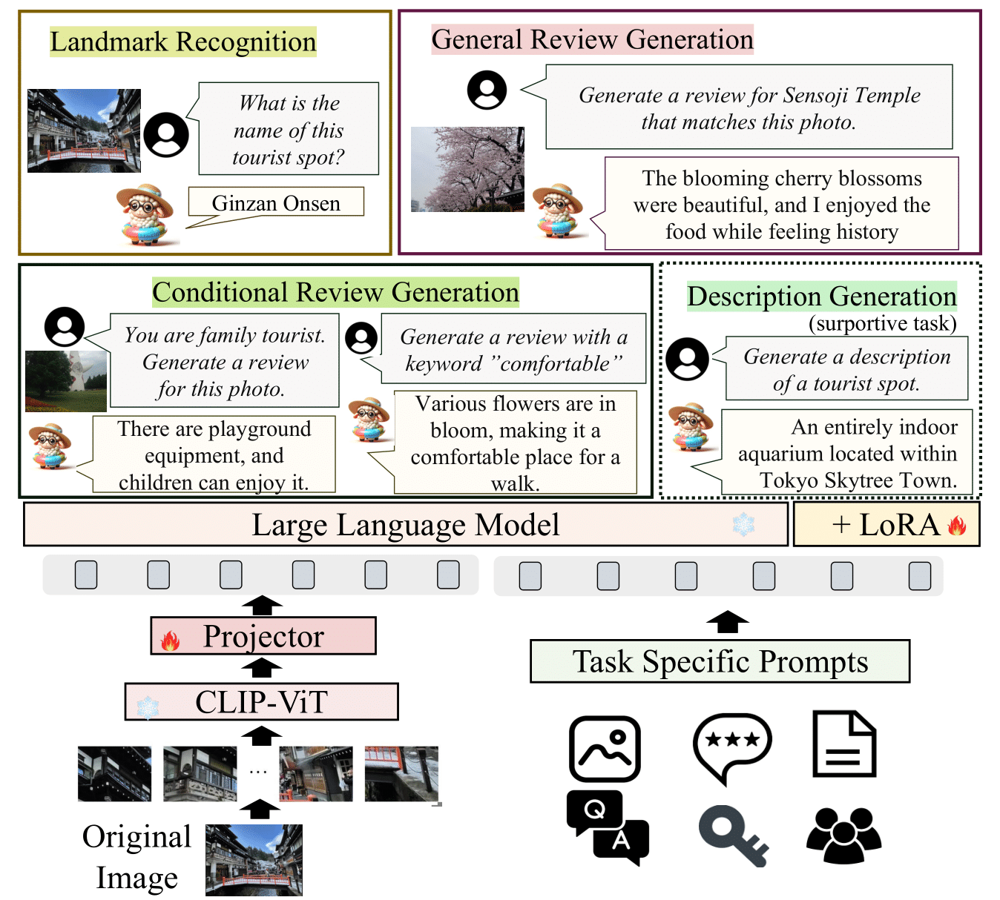
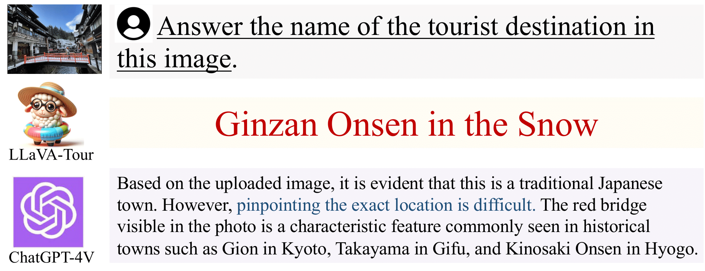
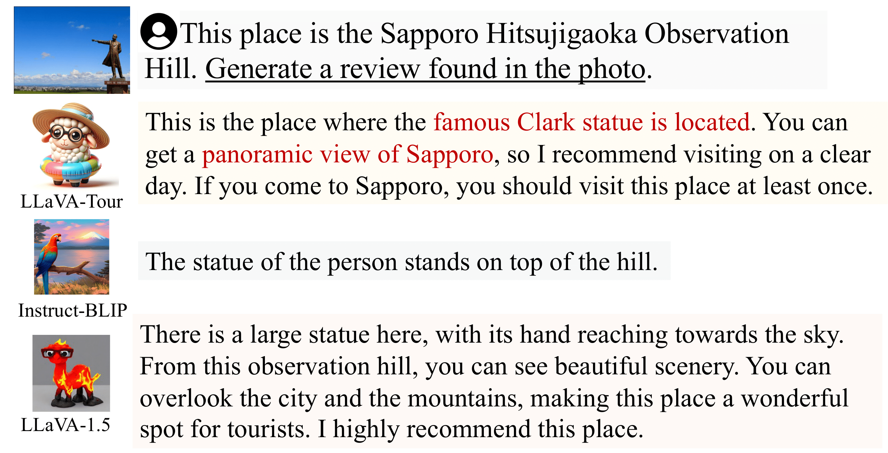

# LLaVATour

## Overview

LLaVATour is a large-scale multimodal model specialized for Japanese tourism. It is trained on a dataset collected from Jalan.net, consisting of over 1.3 million entries covering various tasks such as landmark recognition, description generation, and review generation.

    
    

## Results

### Landmark Recognition

| Model | Acc ↑ (total) | Acc ↑ (pop) | Acc ↑ (mid) | Acc ↑ (low) |
|-------|---------------|--------------|--------------|--------------|
| ChatGPT-4V | 0.026 | 0.0771 | 0.0214 | 0.0172 |
| ChatGPT-4o | 0.155 | 0.275 | 0.160 | 0.119 |
| Gemini-Pro-1.5 | 0.092 | 0.174 | 0.093 | 0.071 |
| ResNet18-FT | 0.143 | 0.207 | 0.152 | 0.119 |
| LLaVA-1.5 | 0.0169 | 0.0378 | 0.0161 | 0.0123 |
| LLaVA-Tour | **0.166** | 0.243 | **0.192** | **0.122** |

### Review Generation

| Model | BLUE ↑ | R-1 ↑ | R-L ↑ | DIV ↑ | PROPN ↑ | TFIDF15 ↑ |
|-------|--------|-------|-------|-------|---------|-----------|
| ChatGPT-4V | 0.622 | 0.250 | 0.165 | **0.955** | 0.278 | 0.100 |
| LLaVA-Tour | **1.489** | 0.249 | **0.179** | 0.919 | **0.449** | **0.127** |
| LLaVA-Tour + context | **1.574** | **0.258** | **0.180** | 0.924 | **0.481** | **0.139** |

### Case Examples

#### Landmark Recognition

#### Review Generation

